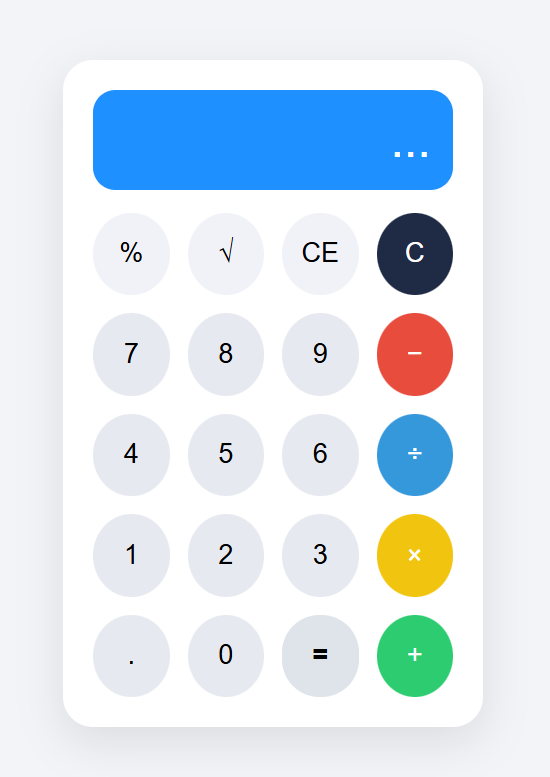

# Partie frontend : 
Cette interface utilisateur simple est intuitive permet d'intéragir avec l'API pour envoyer des calculs et visualiser les résultats stockés.

## Techno utilisées : 
- HTML
- CSS
- Fonctionnalités et connexion au backend avec JavaScript et Node.js

## Visuel : 
Voici à quoi ressemble notre calculatrice : 

